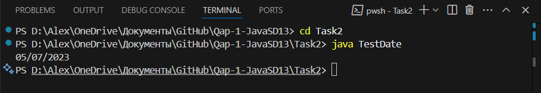
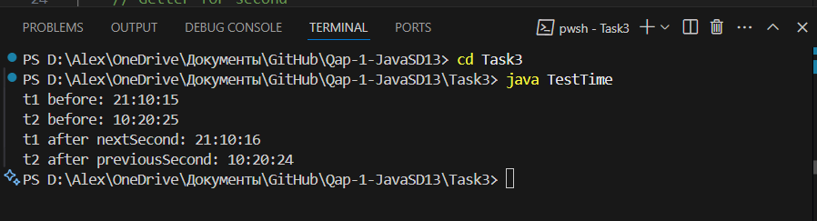

# Questions and answers

1. How many hours did it take you to complete this assessment? - 1 Hour

2. What online resources you have used? - Your lectures, YouTube

3. Did you need to ask any of your friends in solving the problems. - No

4. Did you need to ask questions to any of your instructors? If so, how many questions did you ask (or how many help sessions did you require)? - No

5. Rate (subjectively) the difficulty of each question from your own perspective, and whether you feel confident that you can solve a similar but different problem requiring some of the same techniques in the future now that you’ve completed this one. - 5/10 For all the tasks

# Images

ResultImage  Task1:

ResultImage  Task2:

ResultImage  Task3:
